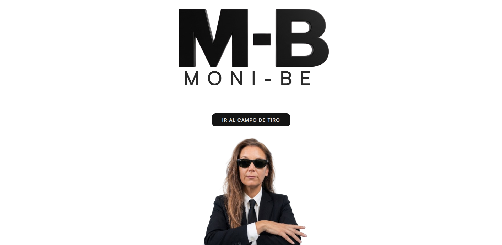
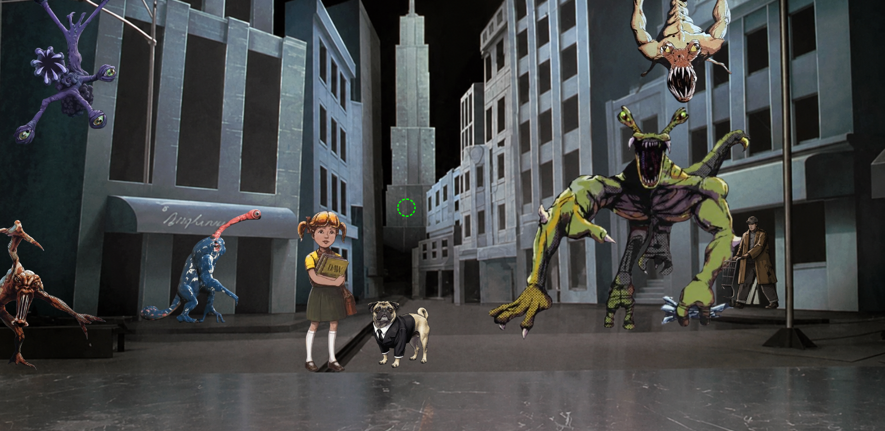

# 🎯 MoniBe - Notas de Junio (MIB Edition)

¡Bienvenido al campo de tiro de **MoniBe**! Proyecto interactivo web inspirado en el universo de *Men in Black* (Hombres de Negro), desarrollado como una forma dinámica, gamificada y original de presentar las calificaciones académicas del ciclo de Desarrollo de Aplicaciones Web (DAW).

El objetivo es simple: ponte en la piel de la Agente Mónica, agarra tu visor neón y elimina a los aliens del callejón para descubrir las notas... pero cuidado, ¡no te dejes engañar por las apariencias!

---

## 🚀 Características Principales

* **Gamificación Real:** Sustitución del clásico boletín de notas por un juego interactivo de disparos en primera persona (*FPS de navegador*).
* **Visor Personalizado (`Custom Crosshair`):** Sistema de mira dinámico que sigue el puntero en tiempo real y cambia de estado (color, tamaño y estilo de línea) al fijar un objetivo (`targeting`).
* **Inyección Dinámica de Datos:** Las asignaturas y sus respectivas notas se renderizan dinámicamente mediante JavaScript utilizando efectos visuales de neón parpadeante mediante animaciones CSS (`@keyframes`).
* **Experiencia Inmersiva de Audio:** Incorporación de banda sonora de fondo con control de volumen atenuado y clonación de nodos de audio en caliente para permitir ráfagas de disparos rápidos sin latencia.
* **Diseño Totalmente Adaptativo (Responsive):** Optimizada la pantalla de presentación mediante *Media Queries* específicas para móviles y tablets, y aplicado un sistema de escalado inteligente (`transform: scale`) en el escenario del juego para asegurar la jugabilidad en pantallas pequeñas.

---

## 🛠️ Tecnologías Utilizadas

* **HTML5:** Estructuración semántica del juego, pantallas y capas de diálogo.
* **CSS3 Avanzado:**
    * Maquetación mediante *Flexbox* y posicionamiento absoluto/relativo de precisión para el despliegue de los aliens.
    * Efectos visuales avanzados (*filtros de imagen, text-shadows de neón, animaciones fluidas*).
    * Diseño Responsive adaptado a dispositivos móviles.
* **JavaScript (Vanilla JS):**
    * Manipulación del DOM y gestión de estados de pantalla (`screen-visible` / `screen-hidden`).
    * Controladores de eventos en tiempo real (`mousemove`, `click`, `mouseenter`, `mouseleave`).
    * Lógica del juego, control de la API de Audio y sistema de colisiones basado en *hitboxes* invisibles para mejorar la experiencia de usuario.

---

## 🎮 ¿Cómo se juega?

1.  Haz clic en el botón **"IR AL CAMPO DE TIRO"** (esto activará la música de fondo y preparará el escenario).
2.  Mueve el ratón por la pantalla; tu cursor se convertirá en una mira verde fosforito.
3.  Apunta al cuerpo (*hitbox*) de los aliens. Verás cómo la mira se vuelve roja y se concentra, indicando que el objetivo está fijado.
4.  ¡Dispara! Al acertar, el alien recibirá un impacto visual y revelará la asignatura junto a su nota final.
5.  **Bonus:** Encuentra el "Alien Real" (Tiffany). Al dispararle, se activará un easter egg con un diálogo especial y la opción de reiniciar el simulador.

---

## 👩‍💻 Autor
Desarrollado con código, cafeína y originalidad por Mónica (MoniBe).

* **Sitio Web:** [monibe.es](https://monibe.es)
* **GitHub:** [@monibe-code](https://github.com/monibe-code)